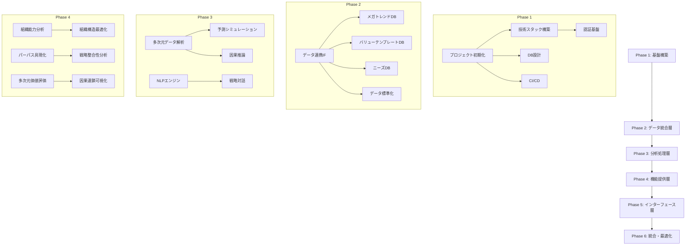

# エグゼクティブコパイロット 開発スケジュール

## プロジェクト概要

| 項目 | 内容 |
|------|------|
| プロジェクト名 | Executive Copilot |
| 開発方式 | アジャイル（2週間スプリント） |
| 総フェーズ | 6フェーズ |
| 並列処理 | 最大4エージェント並列 |

---

## フェーズ別スケジュール

### Phase 1: 基盤構築

**目標**: プロジェクト基盤とコア環境の構築

| タスク | 担当Agent | 依存関係 | 優先度 |
|--------|-----------|---------|--------|
| 1.1 プロジェクト初期化 | CodeGenAgent | なし | P0 |
| 1.2 技術スタック構築 | CodeGenAgent | 1.1 | P0 |
| 1.3 データベース設計 | CodeGenAgent | 1.1 | P0 |
| 1.4 認証基盤構築 | CodeGenAgent | 1.2 | P0 |
| 1.5 CI/CDパイプライン | DeployAgent | 1.1 | P1 |

**並列実行可能**:
- 1.2 + 1.3 (同時実行)
- 1.4 + 1.5 (1.2完了後)

---

### Phase 2: データ統合層

**目標**: 15種類のデータベース連携基盤の構築

| タスク | 担当Agent | 依存関係 | 優先度 |
|--------|-----------|---------|--------|
| 2.1 データ連携IF設計 | CodeGenAgent | Phase 1 | P0 |
| 2.2 メガトレンドDB連携 | CodeGenAgent | 2.1 | P0 |
| 2.3 バリューテンプレートDB連携 | CodeGenAgent | 2.1 | P0 |
| 2.4 ニーズの裏のニーズDB連携 | CodeGenAgent | 2.1 | P0 |
| 2.5 データ標準化エンジン | CodeGenAgent | 2.1 | P1 |
| 2.6 データ品質管理システム | CodeGenAgent | 2.5 | P1 |
| 2.7 メタデータ管理システム | CodeGenAgent | 2.5 | P1 |
| 2.8 成功情報DB連携 | CodeGenAgent | 2.1 | P1 |
| 2.9 シーズDB連携 | CodeGenAgent | 2.1 | P1 |
| 2.10 パートナーDB連携 | CodeGenAgent | 2.1 | P2 |
| 2.11 短期トレンドDB連携 | CodeGenAgent | 2.1 | P2 |
| 2.12 競合情報DB連携 | CodeGenAgent | 2.1 | P2 |

**並列実行可能**:
- 2.2 + 2.3 + 2.4 (最大3並列)
- 2.8 + 2.9 + 2.10 (最大3並列)

---

### Phase 3: 分析処理層

**目標**: AIエンジンと分析システムの構築

| タスク | 担当Agent | 依存関係 | 優先度 |
|--------|-----------|---------|--------|
| 3.1 多次元データ解析エンジン | CodeGenAgent | Phase 2 | P0 |
| 3.2 自然言語処理エンジン | CodeGenAgent | Phase 2 | P0 |
| 3.3 予測・シミュレーションエンジン | CodeGenAgent | 3.1 | P0 |
| 3.4 因果推論エンジン | CodeGenAgent | 3.1 | P1 |
| 3.5 戦略的対話エンジン | CodeGenAgent | 3.2 | P0 |
| 3.6 暗黙知抽出エンジン | CodeGenAgent | 3.2 | P1 |
| 3.7 認知バイアス検出エンジン | CodeGenAgent | 3.2 | P1 |
| 3.8 集合知形成エンジン | CodeGenAgent | 3.1, 3.2 | P2 |
| 3.9 組織学習促進エンジン | CodeGenAgent | 3.1 | P2 |

**並列実行可能**:
- 3.1 + 3.2 (同時実行)
- 3.3 + 3.4 + 3.5 (最大3並列)
- 3.6 + 3.7 (同時実行)

---

### Phase 4: 機能提供層

**目標**: 4つのコア機能エンジンの実装

| タスク | 担当Agent | 依存関係 | 優先度 |
|--------|-----------|---------|--------|
| **価値創造基盤設計機能** |
| 4.1 組織能力分析エンジン | CodeGenAgent | Phase 3 | P0 |
| 4.2 組織構造最適化エンジン | CodeGenAgent | 4.1 | P0 |
| 4.3 エコシステム設計エンジン | CodeGenAgent | 4.1 | P1 |
| **価値整合戦略立案機能** |
| 4.4 パーパス具現化エンジン | CodeGenAgent | Phase 3 | P0 |
| 4.5 戦略整合性分析エンジン | CodeGenAgent | 4.4 | P0 |
| 4.6 多次元シナリオ生成エンジン | CodeGenAgent | 4.5 | P1 |
| **価値主義組織変革機能** |
| 4.7 変革ロードマップ設計エンジン | CodeGenAgent | Phase 3 | P0 |
| 4.8 変革抵抗分析・対応エンジン | CodeGenAgent | 4.7 | P1 |
| 4.9 組織文化変容支援エンジン | CodeGenAgent | 4.7 | P1 |
| **価値創造パフォーマンス管理機能** |
| 4.10 多次元価値評価システム | CodeGenAgent | Phase 3 | P0 |
| 4.11 因果連鎖可視化エンジン | CodeGenAgent | 4.10 | P0 |
| 4.12 動的目標管理システム | CodeGenAgent | 4.10 | P1 |

**並列実行可能**:
- 4.1 + 4.4 + 4.7 + 4.10 (最大4並列)
- 4.2 + 4.5 + 4.8 + 4.11 (最大4並列)
- 4.3 + 4.6 + 4.9 + 4.12 (最大4並列)

---

### Phase 5: インターフェース層

**目標**: UIダッシュボードと対話システムの構築

| タスク | 担当Agent | 依存関係 | 優先度 |
|--------|-----------|---------|--------|
| **ダッシュボード** |
| 5.1 価値創造パルスボード | CodeGenAgent | Phase 4 | P0 |
| 5.2 戦略ナビゲーター | CodeGenAgent | Phase 4 | P0 |
| 5.3 シナリオシミュレーター | CodeGenAgent | 4.6 | P1 |
| 5.4 集合知形成プラットフォーム | CodeGenAgent | 3.8 | P2 |
| **対話システム** |
| 5.5 戦略対話UI | CodeGenAgent | 3.5 | P0 |
| 5.6 洞察キャプチャUI | CodeGenAgent | 3.6 | P1 |
| 5.7 意思決定支援UI | CodeGenAgent | 3.7 | P1 |
| **出力コンポーネント** |
| 5.8 価値創造戦略マップ | CodeGenAgent | 4.11 | P0 |
| 5.9 組織設計ブループリント | CodeGenAgent | 4.2 | P1 |
| 5.10 資源配分ポートフォリオ | CodeGenAgent | 4.12 | P1 |
| 5.11 リーダーシップ開発プログラム | CodeGenAgent | 4.9 | P2 |

**並列実行可能**:
- 5.1 + 5.2 + 5.5 + 5.8 (最大4並列)
- 5.3 + 5.6 + 5.9 (最大3並列)
- 5.4 + 5.7 + 5.10 + 5.11 (最大4並列)

---

### Phase 6: 統合・最適化

**目標**: システム統合、テスト、最適化

| タスク | 担当Agent | 依存関係 | 優先度 |
|--------|-----------|---------|--------|
| 6.1 他コパイロット連携 | CodeGenAgent | Phase 5 | P0 |
| 6.2 統合テスト | ReviewAgent | 6.1 | P0 |
| 6.3 パフォーマンス最適化 | CodeGenAgent | 6.2 | P0 |
| 6.4 セキュリティ監査 | ReviewAgent | 6.2 | P0 |
| 6.5 ドキュメント整備 | CodeGenAgent | 6.3 | P1 |
| 6.6 本番デプロイ | DeployAgent | 6.4 | P0 |
| 6.7 運用監視設定 | DeployAgent | 6.6 | P1 |

**並列実行可能**:
- 6.3 + 6.4 (同時実行)
- 6.5 + 6.6 (同時実行)

---

## DAG (Directed Acyclic Graph) 構造



---

## エージェント割り当て

| Agent | 主要責任 | 並列実行数 |
|-------|---------|----------|
| CoordinatorAgent | タスク分解・DAG管理・進捗監視 | 1 |
| CodeGenAgent | コード生成・テスト作成 | 4 |
| ReviewAgent | 品質チェック・セキュリティ監査 | 2 |
| DeployAgent | CI/CD・デプロイ・監視 | 2 |
| IssueAgent | Issue分析・ラベリング | 1 |
| PRAgent | PR作成・Conventional Commits | 1 |

---

## 並列処理戦略

### メモリ最適化（最大92%使用）

```typescript
interface ParallelExecutionConfig {
  maxConcurrentAgents: 4;
  memoryLimit: '92%';
  taskQueueStrategy: 'priority-based';
  loadBalancing: 'dynamic';
}
```

### 並列実行ルール

1. **依存関係のないタスク**: 最大4並列で実行
2. **依存関係のあるタスク**: 順次実行
3. **リソース競合時**: 優先度に基づいて調整
4. **失敗時**: 自動リトライ（最大3回）

---

## マイルストーン

| マイルストーン | フェーズ | 成果物 |
|---------------|---------|--------|
| M1: 基盤完成 | Phase 1 | 開発環境、CI/CD、認証基盤 |
| M2: データ連携完成 | Phase 2 | 15種DB連携、データ品質管理 |
| M3: AIエンジン完成 | Phase 3 | 分析エンジン、対話システム |
| M4: コア機能完成 | Phase 4 | 4つのコア機能エンジン |
| M5: UI完成 | Phase 5 | ダッシュボード、出力コンポーネント |
| M6: リリース | Phase 6 | 本番デプロイ、運用開始 |

---

## リスク管理

| リスク | 影響度 | 対策 |
|--------|--------|------|
| AI APIレート制限 | 高 | キャッシュ、バッチ処理 |
| メモリ不足 | 高 | 動的スケーリング、最適化 |
| 依存関係の遅延 | 中 | バッファ期間、並列化 |
| 品質基準未達 | 中 | 継続的レビュー、自動テスト |

---

## 進捗追跡

### Miyabiワークフロー連携

```yaml
labels:
  state:
    - state:pending      # 未着手
    - state:analyzing    # 分析中
    - state:implementing # 実装中
    - state:reviewing    # レビュー中
    - state:done         # 完了
    - state:blocked      # ブロック

  phase:
    - phase:planning     # 計画フェーズ
    - phase:design       # 設計フェーズ
    - phase:development  # 開発フェーズ
    - phase:review       # レビューフェーズ
    - phase:deployment   # デプロイフェーズ
```

---

**ドキュメントバージョン**: 1.0.0
**最終更新日**: 2024-11-30
**作成者**: Miyabi AI Agent
